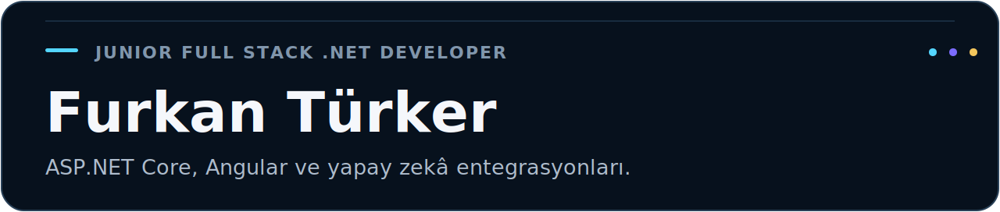
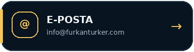
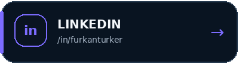
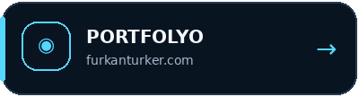
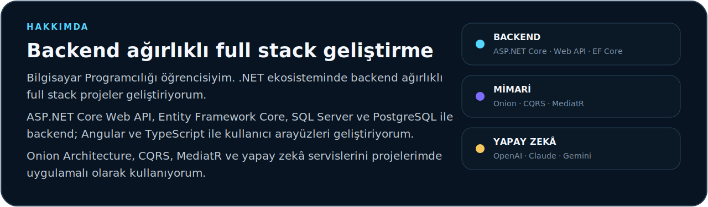
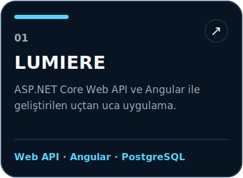
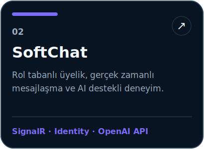
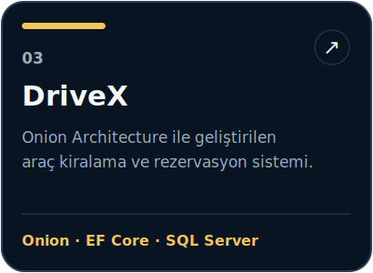
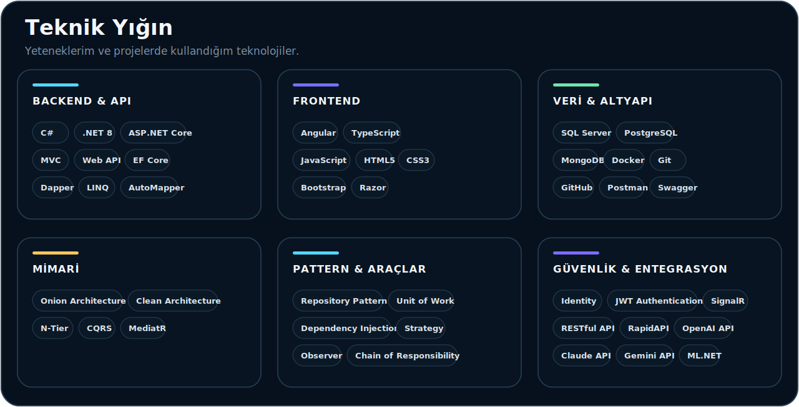

  <picture>
    <source media="(prefers-color-scheme: dark)" srcset="./assets/hero-dark-v28.svg" />
    <source media="(prefers-color-scheme: light)" srcset="./assets/hero-light-v28.svg" />
    
  </picture>

  <picture>
    <source media="(prefers-color-scheme: dark)" srcset="./assets/typing-dark-v28.svg" />
    <source media="(prefers-color-scheme: light)" srcset="./assets/typing-light-v28.svg" />
    
  </picture>

  <picture>
    <source media="(prefers-color-scheme: dark)" srcset="./assets/separator-dark-v24.svg" />
    <source media="(prefers-color-scheme: light)" srcset="./assets/separator-light-v24.svg" />
    
  </picture>

<h3 align="center">Bağlantılar</h3>

  <a href="mailto:info@furkanturker.com">
    <picture>
      <source media="(prefers-color-scheme: dark)" srcset="./assets/contact-email-dark-v24.png" />
      <source media="(prefers-color-scheme: light)" srcset="./assets/contact-email-light-v24.png" />
      
    </picture>
  </a>
  <a href="https://www.linkedin.com/in/furkanturker">
    <picture>
      <source media="(prefers-color-scheme: dark)" srcset="./assets/contact-linkedin-dark-v24.png" />
      <source media="(prefers-color-scheme: light)" srcset="./assets/contact-linkedin-light-v24.png" />
      
    </picture>
  </a>
  <a href="https://furkanturker.com">
    <picture>
      <source media="(prefers-color-scheme: dark)" srcset="./assets/contact-portfolio-dark-v24.png" />
      <source media="(prefers-color-scheme: light)" srcset="./assets/contact-portfolio-light-v24.png" />
      
    </picture>
  </a>

  <picture>
    <source media="(prefers-color-scheme: dark)" srcset="./assets/about-dark-v29.svg" />
    <source media="(prefers-color-scheme: light)" srcset="./assets/about-light-v29.svg" />
    
  </picture>

## Öne Çıkan Projeler

  <a href="https://github.com/furkanturkerr/LUMIERE-Server">
    <picture>
      <source media="(prefers-color-scheme: dark)" srcset="./assets/project-lumiere-dark-v27.svg" />
      <source media="(prefers-color-scheme: light)" srcset="./assets/project-lumiere-light-v27.svg" />
      
    </picture>
  </a>
  <a href="https://github.com/furkanturkerr/SoftChat">
    <picture>
      <source media="(prefers-color-scheme: dark)" srcset="./assets/project-softchat-dark-v27.svg" />
      <source media="(prefers-color-scheme: light)" srcset="./assets/project-softchat-light-v27.svg" />
      
    </picture>
  </a>
  <a href="https://github.com/furkanturkerr/DriveX">
    <picture>
      <source media="(prefers-color-scheme: dark)" srcset="./assets/project-drivex-dark-v27.svg" />
      <source media="(prefers-color-scheme: light)" srcset="./assets/project-drivex-light-v27.svg" />
      
    </picture>
  </a>

  <picture>
    <source media="(prefers-color-scheme: dark)" srcset="./assets/tech-dark-v30.svg" />
    <source media="(prefers-color-scheme: light)" srcset="./assets/tech-light-v30.svg" />
    
  </picture>

## Gün Serisi

  <picture>
    <source
      media="(prefers-color-scheme: dark)"
      srcset="https://streak-stats.demolab.com?user=furkanturkerr&theme=transparent&hide_border=true&locale=tr&ring=4CC9F0&fire=4CC9F0&currStreakLabel=4CC9F0&sideLabels=CBD5E1&currStreakNum=F8FAFC&sideNums=F8FAFC&dates=64748B"
    />
    <source
      media="(prefers-color-scheme: light)"
      srcset="https://streak-stats.demolab.com?user=furkanturkerr&theme=transparent&hide_border=true&locale=tr&ring=2563EB&fire=2563EB&currStreakLabel=2563EB&sideLabels=475569&currStreakNum=0F172A&sideNums=0F172A&dates=64748B"
    />
    
  </picture>

